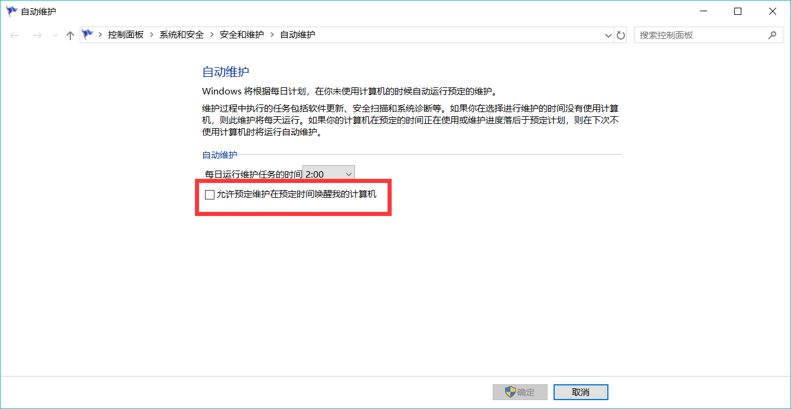
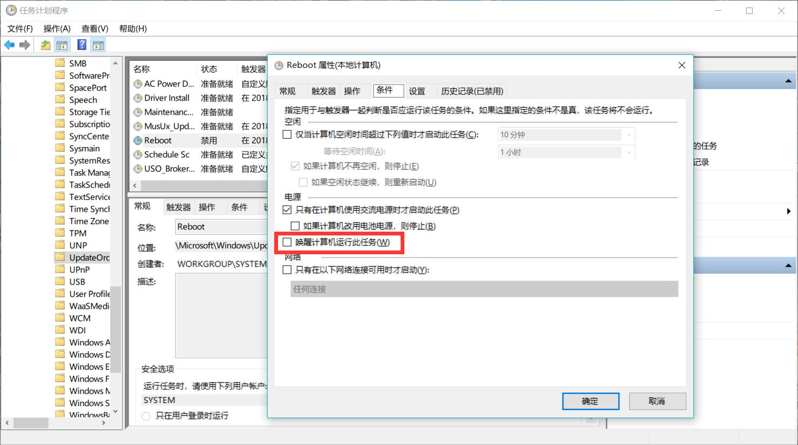

Windows 的睡眠是个好东西，这让 Windows 也有了 Mac 的合盖即走的功能。在不出意外的情况下合盖即走与 Mac 的体验相差无异。

虽然之前有睡眠后无法唤醒的报道，不过我想都 8102 年了应该不会再有这种大问题吧，所以也没怎么在意一直这么用着。

直到昨天下午在我合盖之后把电脑放进包里之后，发生了一件令人发指的事情，电脑被计划任务的自动更新唤醒了进入了更新状态。幸好发现的及时赶紧拿了出来，不过还是非常的烫手（在这里要吐槽一下这辣鸡自动更新的CPU使用）。

再吐槽一下微软的奇葩设定，合盖睡眠也要唤醒自动更新，结果就是自动更新带来的热量差点没出大事，原本我看到一句开玩笑的话“不自动更新你的电脑就要爆炸啦”，这回我觉得按它的自动更新我的电脑真的会爆炸。

好像有点跑题了，那么说回正题，避免电脑在睡眠的时候被系统意外唤醒（这里不包括主动唤醒）。

---

使用一年下来目前已知两种被系统意外唤醒的情况：

1. 自动维护

通常是在半夜二点的时候会被唤醒，在 控制面板>系统和安全>安全和维护>自动维护 中把 “允许预定维护在预定时间唤醒我的计算机” 取消勾选即可。
 

2. 不人性化的自动更新 

已经被万人吐槽了，只要不睡眠的时候强制唤醒来更新我没意见。

在 2017 年底的时候还可以手动修改任务计划取消“唤醒计算机运行此任务”。

Win+R 输入 taskschd.msc ，在 任务计划程序-任务计划程序库-Microsoft-Windows-UpdateOrchestrator 中找到 Reboot ，右键打开 Reboot 项的属性，在条件页面中取消“唤醒计算机运行此任务”的勾选。

最后，希望微软的自动更新动动脑子，人性化一点，别再这么令人发指了！ 